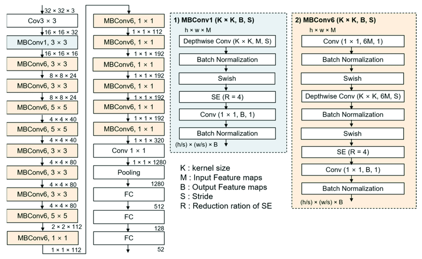

# Image Classification With Deep Neural Networks:

In this repository, we are going to employ several different Deep Learning models to do image classification projects. 

## Project 1: Sports Dataset:

This dataset contains 100 different types of sports. We aim to train a Deep learning model on the training dataset and validating on the validation dataset to predict the name of sports by using an image as the input.

### Model:

We used the EfficentnetB0 from TensorFlow Hub. EfficientNet-b0 is a convolutional neural network trained using a large dataset of over a million images from the ImageNet database, enabling it to classify images into 1000 different categories, including objects like keyboards, mice, pencils, and various species of animals.

The archtecture of EfficentnetB0 

## Results

After training the model on the training dataset and evaluating it on the evaluation dataset for 20 epochs, the results of the prediction on the test dataset are as below. 

training_loss: 0.0052 - training_accuracy: 0.9990 

val_loss: 0.0977 - val_accuracy: 0.9680

test_loss: 0.0703 - test_accuracy: 0.9720

The results are satisfying, with more than 97% accuracy on the unseen test dataset.

# Project 2

In this project, we aim to predict the type of fruits with a simple Conv2D model and ResNet V50 from TensorFlow Hub which is a convolutional neural network that is 50 layers deep.

## Results

After training the model on the training dataset and evaluating it on the evaluation dataset for 5 epochs, the results of the prediction with Conv2D model on the test dataset are as below.  

Conv2D model : test_loss: 0.2465  - test_accuracy: 0.9137 

After training the model on the training dataset and evaluating it on the evaluation dataset for 4 epochs, the results of the prediction with ResNet V50 model on the test dataset are as below.  

Conv2D model : test_loss: 0.1106  - test_accuracy: 0.9747

We can conclude that the ResNet V50 performs better on the unseen test dataset.

# Project 3: Classifying Leaves using Image Processing and Neural Networks

### Introduction:
This report presents a method for classifying leaves into healthy and diseased categories using image processing and neural network techniques. The data used in this project is a combination of a CSV dataset table and a folder of images. The primary focus of this project is to process the data from the data frame effectively. Another aspect of this project is addressing the challenge of dealing with the multiple label imbalance issue.

### Methods:
To achieve the goal of classifying leaves, the following steps were taken:

Data collection: The data for this project was collected from a CSV dataset table and a folder of images.

Data Preparation: The data frame was processed to make it ready for use in the classification model. This was achieved by utilizing the image data generator and flow from dataframe methods. To handle the issue of data imbalance, an over-sampling technique was applied.

Image processing: The images were processed to enhance their features and make them suitable for input into the neural network.

Neural network modeling: A neural network, EfficientNetB0 from TensorFlow Hub, was trained and tested on the processed data to classify the leaves into healthy and diseased categories.

### Results:
The results of this project showed that the method of classifying leaves using image processing and neural networks was effective in accurately distinguishing between healthy and diseased leaves with around 90% accuracy on the test dataset.

### Conclusion:
In conclusion, this report presented a method for classifying leaves into healthy and diseased categories using image processing and neural network techniques. The results of this project showed that this method was effective in accurately distinguishing between healthy and diseased leaves. The primary focus of this project was on the processing of data from the data frame, which was crucial for the success of the project.

